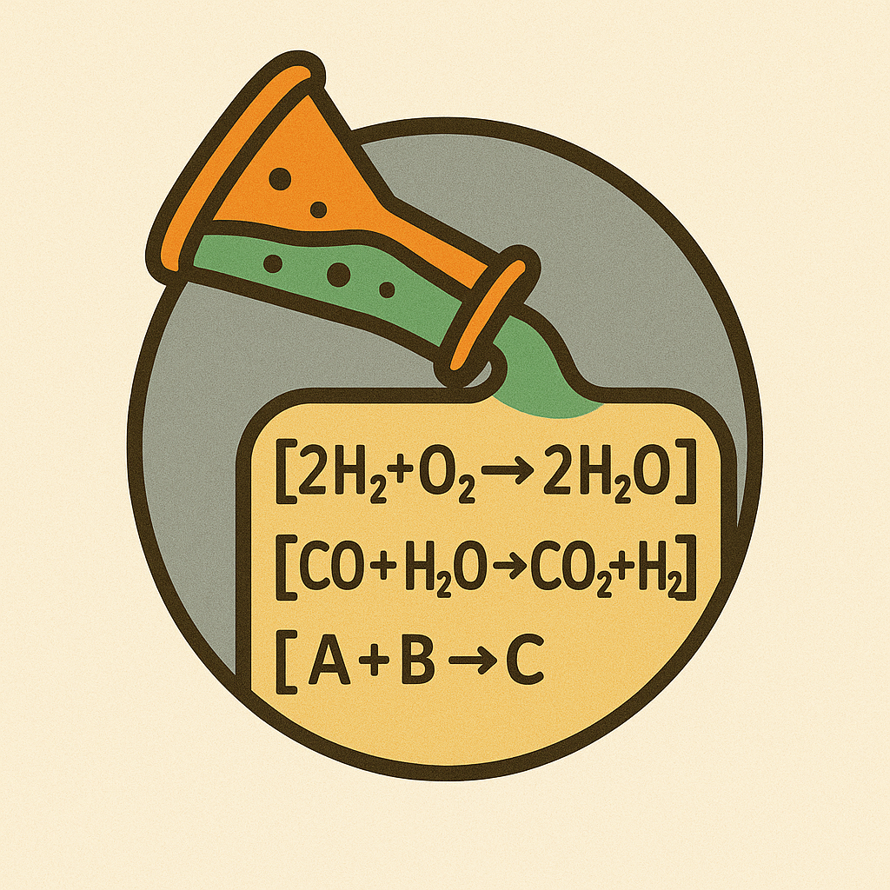

[](https://github.com/badw/reactit/actions/workflows/tests.yml)


### `reactit` -  **React**ion **It**erator 

`reactit` is a code for generating all possible reactions between species in an efficient manner.


#### Installation 

```
git clone https://github.com/badw/reactit.git 
cd reactit 
pip install . 
```

#### Examples 

an example Jupyter Notebook can be found here: 


`./examples/reactit.ipynb`


simple usage: 

```
from reactit import ReactionGenerator

rg = ReactionGenerator( compounds = {0:'CO2',1:'H2O',2:'H2',3:'CO'} )
reactions = rg.iterate(max_length=4)

reactions
```

> ['1 CO2 + 1 H2 = 1 H2O + 1 CO']


##### `chempy`, `pymatgen` and `networkx` support 

support for [https://github.com/bjodah/chempy.git](chempy) `Equilibrium` and [https://github.com/materialsproject/pymatgen.git](pymatgen) `BalancedReaction` objects are included: 

```
chempy_reactions = rg.to_chempy()
chempy_reactions[0]
```
> Equilibrium(CO2 + H2 ↔ CO + H2O)

```
pymatgen_reactions = rg.to_pymatgen()
pymatgen_reactions[0]
```
> BalancedReaction(H2 + CO2 -> H2O + CO)

```
networkx_graph = rg.to_networkx_graph()

import networkx as nx 

node_colours= []
node_sizes = []
for node in list(graph.nodes):
    if isinstance(node,int):
        node_colours.append('red')
        node_sizes.append(25)
    else:
        node_colours.append('blue')
        node_sizes.append(100)

nx.draw_random(graph,node_color=node_colours,node_size=node_sizes,width=0.1)
```


---

#### Todo: 
- [ ] ability to pass `SMILES` strings to form `SMILES` equations 
- [ ] multiprocessing for particularly large reaction sets
- [ ] save to file 
- [ ] `CLI`
